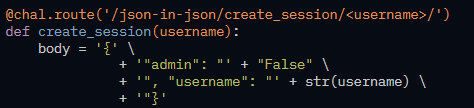

## Analysis
* This challenge is not associated with encryption but rather an injection attack.
* The injection attack can be immediately identified because the user input is used unsanitised inside the JWT payload.
* One more important thing to note for this challenge and why our injection will work is how JSON duplicate values are handled. Inside a JSON object any duplicate values overwrite the previous value with the same identifier when it get's deserialised.

## Solution
1. After looking at the source code we can notice the following code:

2. The unsanitised user input can be manipulated and trick the server into signing us an admin JWT token.
3. Having the JSON handling policy for duplicate values in mind we car craft a specific payload `", "admin": "True"`, that will put a duplicate value for `admin` inside the json.
4. Now, when the server will try deserializing our token, the first value will be thrown away and we will get admin permissions.

Note: One question that popped into my mind is: "Does this injection attack also work in the previous challenges?"

In the previous challenges the username input is added FIRST in the json and the admin value SECOND so we can only modify values that will get overwrited by the last value which will be `"admin": "False"`.
