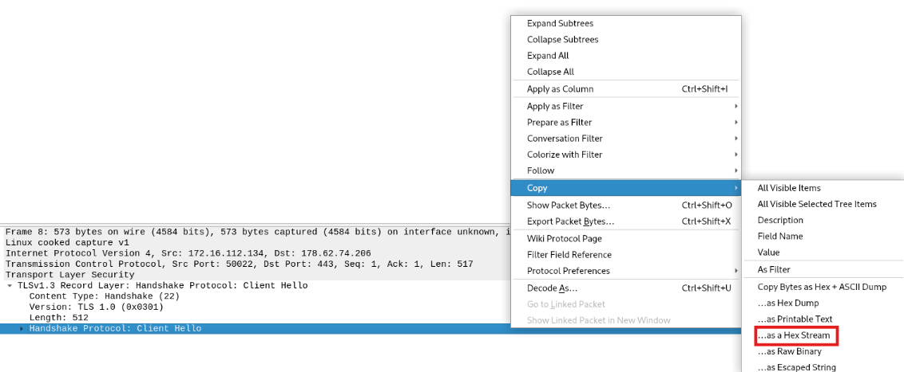
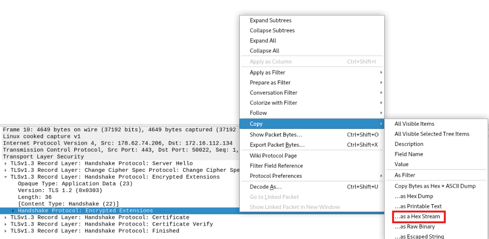

### Analysis
For this challenge we will have to script provided by the exercise and fill in teh values
in order to craft te client verify message. The exercise provides a `.pcapng` file which includes
a TLS connection until the `Server Finished` message. It is also giving us the Ephemeral Diffie-Hellmann key
which we can use to decrypt the conversation and see the TLS packets.

### Solution
1. Copy the python script locally provided by the exercise.
2. Load the `.pcapng` on wireshark and decrypt it as we did in `Decrypting TLS 1.3` challenge.
3. Fill in the `client_handshake_traffic_secret` value with the key found in the keylog file. 
The key is the second value of `CLIENT_HANDSHAKE_TRAFFIC_SECRET`

Now we need to fill the rest of the values with the hex streams of the corresponding packets:
* Warning: Do not copy the whole packet, the record layers of the packets are not needed!
1. For the `client_hello` variable find the `Client Hello` packet (packet no. 8) and use the dropdown menu to find the value of the `Client Hello` packet excluding the record layer. Copy as hex stream and add it to the script placeholder:

2. For the `server_encrypted_extensions` find the `Server Hello` (packet no. 10) and use the dropdown menu to find `TLSv1.3 Record Layer: Handshake Protocol: Encrypted Extensions`. Export the actual packet (excluding the record layer) as hex stream:

3. Do the same for the rest of the packets and fill in the values in the script.
4. Run the script and it should forge the client verify message missing from the `.pcapng` capture.
