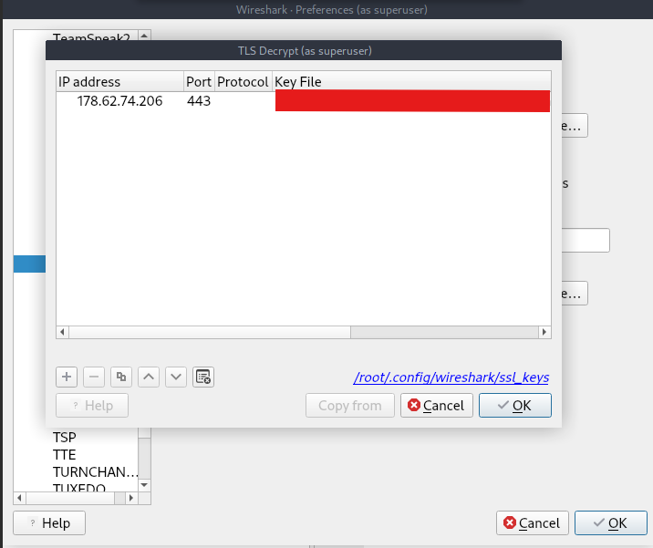
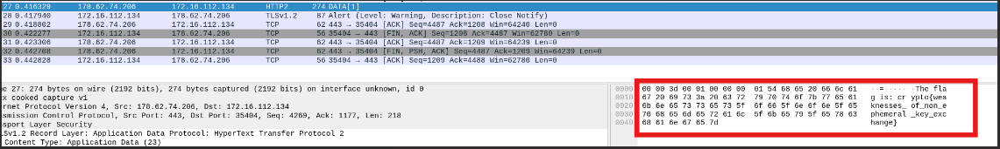

### Analysis
For this challenge we will have to decrypt a TLS 1.2 conversation using Wireshark.

The private key is given to us so all we have to do is add it to Wireshark and the whole conversation will automatically get decrypted.

### Solution
1. Go to `Edit → Preferences → Protocols → TLS`.
2. On the TLS page, select `Edit` below the RSA keys list → a new window will open.
3. Click the `+` button to add a new key.
4. Add the server IP which is `178.62.74.206`, the server port which is `443` (default TCP/TLS) and the private key file path provided by the exercise:

5. We can now view everything in plaintext. If we browse the HTTP packets we can see the flag in packet no. 27:

