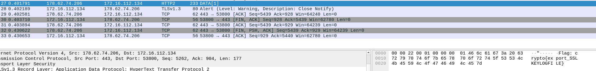

## Analysis
For this challenge we will have to decrypt a TLS 1.3 conversation using Wireshark.

The Diffie-Hellman ephemeral key parameters are given to us by the exercise so all we have to do is add the key in Wireshark.

## Solution
1. Go to `Edit → Preferences → Protocols → TLS`.
2. On the TLS page, there is a section named `(PRE)-Master-Secret log filename`.
3. Add the path to the keylogfile given by the exercise inside the placeholder.

4. We can now view everything in plaintext and if we browse the HTTP packets we can see the flag in packet no. 27:

