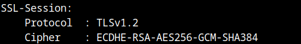
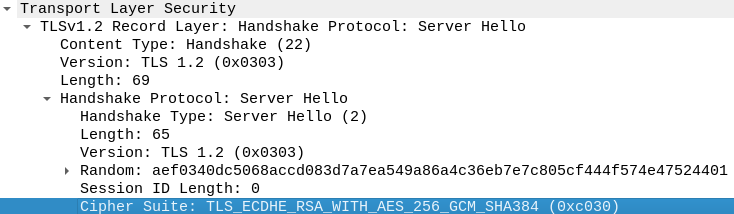

## Analysis
To solve the challenge we will have to find the cipher suite used by `tls1.cryptohack.org:443` when we initiate a connection with `TLS 1.2`. 

Browsers nowadays will try and communicate using `TLS 1.3` if it is supported so we will have to use some other tool in order to enforce `TLS 1.2`.

## Solution
1. We can use the following command to get the `TLS 1.2` information from the server by using `openssl`:

```bash
openssl s_client -connect tls1.cryptohack.org:443 -tls1_2
```

2. We can see the cipher suite in the output:



3. If we captured the connection with wireshark we can see the cipher suite in the `Server Hello` TCP packet:



4. For the Open SSL format we have to remove the `TLS_` protocol from the cipher suite and convert underscores to dashes.
