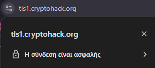
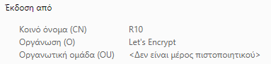

## Analysis
This challenge requires to find the CA of the TLS certificate of one of cryptohacks subdomains.

## Solution
1. Visit `https://tls1.cryptohack.org/`
2. Click on the small lock on the left of the URL placeholder:

3. Open the certificate.
4. The CA name is under the `Issued by` section:

