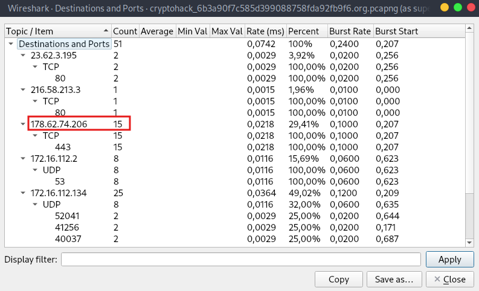

### Analysis
This challenge is teaching us about wireshark but we should all know a thing or two already.

The challenge requires us to find how many packets where sent to cryptohack.org (with IP `178.62.74.206`) which can be done by a simple display filter on the `.pcapng` file provided.
* Alternative solution: use the statistics tab.

### Solution
1. Open the provided file inside wireshark: `file -> open`
2. Apply the display filter for destination IP: `ip.dst_host==178.62.74.206`

3. Count the rows

#### Alternatively:
1. Open the statistics tab and go to `IPV4 statistics -> Destinations and Ports`

2. A new window will appear where we can see the IP we want (`178.62.74.206`) has 15 packets counted.

