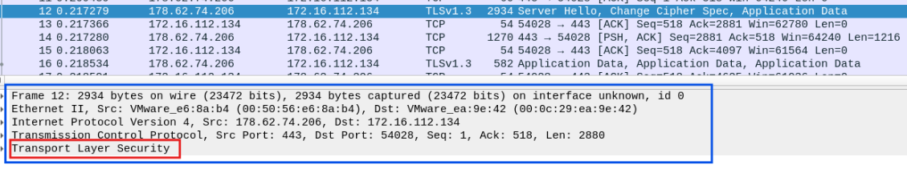
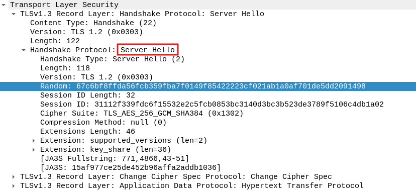

### Analysis
This challenge is doing a packet analysison the TCP and TLS protocols.
We are asked to find the random 64 bytes sent in the `Server Hello` packet of our host to the server,
which can be done by a detailed analysis in the corresponding packet.

### Solution
1. Load the `.pcapng` file on wireshark.
1. Find the `Server Hello` packet which is packet number 12.
2. In the blue area we can see the packet details and in the red area is the TLS details:

3. Now if we open the TLS details we can find the random bytes in the `Server Hello` section under the record layer:

