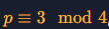

## Analysis & Solution
In this challenge we are only given coordinate X from Alice, but that is no problem because we can just apply X to the elliptic curve equation to find Y.

After calculation the `x**3 + a * x + b` as RHS (right-hand-side) , we now have to solve `y^2 = RHS mod p`. Although `p` has the following property:



so we can apply the following which occurs from the Tonelli-Shanks method:

```
y^2 = a mod p => y = a ^ ((p+1)/4) mod p
```

Now that we found `y` coordinate, we have both Alice coordinates and we can calculate the shared secret.