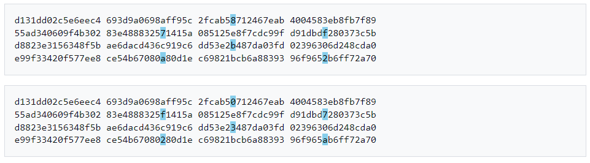

### Analysis
This challenge gives gives us the source code of the server and we can notice that in order to get the flag we will have to find an MD5 collision. MD5 hash algorithm has served us well over the years but as of now, it is not a secure hasking algorithm, as it has been broken and easy to find collisions. Attackers can get advantage of the block processing of MD5 and find stream of bytes that product the same hash. There are also plenty of tools I found online that based on a document and the given hash can give you another document with the same hash, although it is not necessary for the challenge, here we just need to send 2 documents that result in the same hash.
* More info at `https://en.wikipedia.org/wiki/MD5`

### Solution
1. In the wikipedia page you can find an example of 2 HEX streams that produce the same hash `79054025255fb1a26e4bc422aef54eb4`:

2. We copy these two for the challenge in order to create a collision and get the flag.
