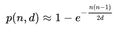
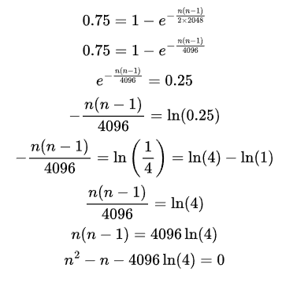

### Analysis
This challenge is indeed the same as the birthday paradox.
The challenge is asking to find the number of secrets we need given the propability (like the number of persons in the birthday paradox).
* https://en.wikipedia.org/wiki/Birthday_problem

### Solution
1. From the wiki page we can take the birthday paradox equation which is:

Note: in the wiki page the number of persons is the letter `n` and the total people is the leter `d`, thus we need to calculate `n`.

2. Adjusted to our problem:
    * d = all possible hashes = 2^11 = 2048
    * p = 0.75
3. This is my calculations written in latex:

4. This is the point where we use chatGPT to do the rest:
`n1 ~ 75.86`
`n2 ~ -74.86`
