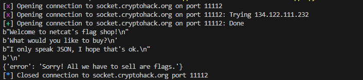

### Analysis
This challenge is an introduction on how to communicate with cryptohack's server by giving a python script that sends and receives a json from their server.

By running the script we get the following output:



That means we need to change something in the json in order to "buy" the flag.

### Solution

1. Change the json payload to 
```json
{
    "buy": "flag"
}
```
2. Send it to receive the flag.

### Flag - 5 pts
`crypto{?}`