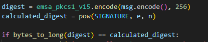

## Analysis
### Step 1: Analyze the server source code
By looking at the server source code we can notice that in order to take the flag we need to send a message that will match a specific regex and also satisfy the below condition where `SIGNATURE` is something we can retrieve from the server:

### Step 2: Break down the problem
The message we must provide must match a specific regex so we cannot modify it much, let us suppose it is static. We can provide our own `n` and `e` though.

By looking at the picture above, we have static numbers for `digest` and `SIGNATURE` and we can only manipulate `n` and `e`.

Thus the problem we need to solve is `m^e mod n = k` for known `k` and `m` (`m` = `SIGNATURE`, `k` = `our_message`)

## Solution
1. For `m^e mod n = k` to be solvable, the following rule must apply: `k < m^e / 2 `. 
   
Why is this true? Think that `k` is the remaider of the division of the number `m^e` with another number `n`. If the remainder is bigger than the `divisor / 2` that means the divisor got divided with a number bigger than `divisor / 2` which is not possible for primal integers. Thus, it not possible for the remaider to be bigger than the divisor's half.

2. So we try for `e = 1, e = 2, e = 3...` until the above rule is satisfied (remember that we already know `m` which is the `SIGNATURE`).
3. From modular arithmetics we know that the biggest modulus to satisfy `m^e mod n = k` for given `m`, `e`, `k` is the difference `m^e - k`. Other smaller numbers that are divisors of `m^e - k` might also satisfy the equation but we only need 1.
4. For the challenge, we pick a message that satisfies the server regex e.g "I am Mallory and I own CryptoHack.org". 
5. We also receive the signature from the server by sending a json with the option "get_signature".
6. Now we calculate the `digest` of this message and apply the mathematics explained above for `m` = `SIGNATURE`, `k` = `digest` to find a suitable `e`, `n`.

