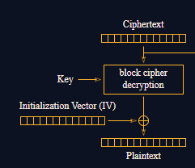

## Analysis
In this challenge it seems liek we can manipulate the IV given in the decrypt function. The IV is 16 bytes and it is used to decode the first 16 bytes of the ciphertext in CBC.

If we can manipulate the IV, we can also manipulate the first 16 bytes of the output without caring about the AES encryption at all.

How? Take a look at this picture.



We can notice that: 

1) We can calculate the cipher block output for the original cookie which includes `admin=False`
```
block_cipher_decryption_output ^ IV = plaintext
=> block_cipher_decryption_output = plaintext ^ IV
```

2) We can manipulate the IV in order to change the plaintext because we already know the cipher block output:
```
block_cipher_decryption_output ^ new_IV = new_plaintext
=> new_IV = new_plaintext ^ block_cipher_decryption_output
```

## Solution
1) Receive an original cookie
2) Split the cookie into the IV which is the first 16 bytes (32 hex chars) and to the first cipher block which is the next 16 bytes.
3) Calculate the cipher block output for that cookie by calculating:
   
   `plaintext_first_16_bytes ^ IV`

    By looking at how the cookie is made, the first 16 bytes of the plaintext is:
    
    `admin=False;expi`
4) We need to make transform the first 16 bytes into `admin=True;;expi` by modifying the IV. We already know the block output and the text we want our plaintext to be transformed into, so the new IV can be calculated as (see analysis):

    `b'admin=True;;expi' ^ block_cipher_decryption_output`
5) Send the original cookie with the new modified IV to receive the flag