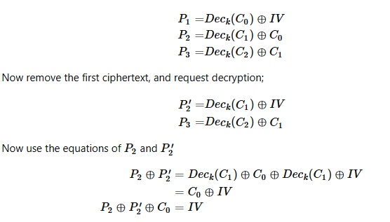

## Analysis
In this challenge the same IV is used for every encryption and decryption and we have to find it.

This challenge is a pure math puzzle and the solution is very interesting.

The key part of this challenge is that if we provide a non ASCII plaintext to the `receive` endpoint,
 then the decrypted text is printed.

## Solution
This is the CBC decryption equations that if manipulated correctly, by using a 2 block ciphertext we can contruct the IV:

Source: https://crypto.stackexchange.com/questions/88494/finding-the-iv-of-aes-cbc-ctf